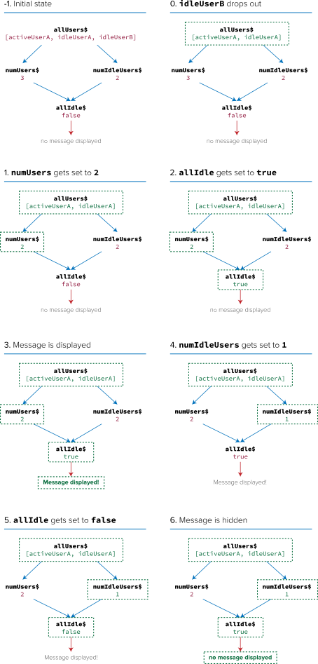
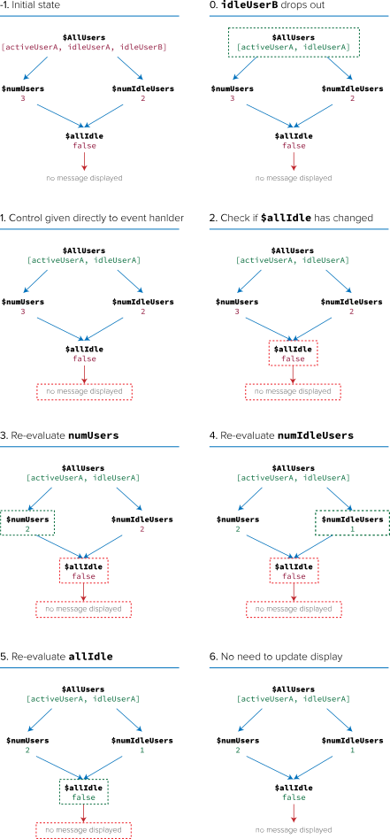

This (unfinished) document describes the rationale for and ideas behind DerivableJS.

## State made simple

### Derived and Atomic state

We tend not to think about it much, but there are a few different kinds of application state:

- **Constant state** is defined at compile/init time. It never changes for the lifetime of an application and is therefore of no relevance here.

- **Stack state** is created on a runtime call stack and bound to that same stack. e.g. loop variables and intermediate results. It is, at all times, under the influence of only one thread of control.

  Programming languages tend to have nice support for managing stack state and nobody ever complains about it being especially hard. Think lexically-scoped variables, function parameters and return values, RAII, try-catch-finally, and so on.

  Functional programming languages turn the simplicity up a notch here by enabling or enforcing the use of pure functions and immutable data, which are effective tools to restrict the set of ways in which stack state may be updated. Languages opting for the *enforcing* approach, like Haskell, actually *prohibit* directly updating stack state in source code. And this prohibition ends up allowing the compilers to emit machine code capable of all kinds of clever and safe stack mutation.

Some applications need only these two kinds of state, being essentially just functions themselves. e.g. compilers, audio/video transcoders, etc. But the vast majority of applications we use do this other thing where they have internal state which can be modified by external events. They are susceptible to *incursions of control* which carry some piece of data—explicitly or otherwise—through a new call stack, normally causing internal state changes and/or side effects. This internal, changing state can be further categorized:

- **Atomic state** is normalized data dependent only on things which have happened in the past to cause incursions of control into the system, e.g. clicking the 'increment' button in a counter app causes the 'count' piece of atomic state to change. If you use Redux, your whole store is probably atomic state. Other examples of atomic state in a web browser: mouse position, window size, and page scroll offset. On the backend: session data, DB cache, ...

  Modern practices from the FP world are also making atomic state fairly simple to manage. Immutable data and pure functions combine well with things like software transactional memory, the actor model, atomic references, event sourcing, and so on. Again, these are *restrictive* tools for shrinking the set of ways in which state may be updated, all with the apparent added bonus of increasing Reasonaboutability™.

- **Derived state** is directly dependent only on the *current* value of other bits of state. To illustrate:

  - **Whether or not an input form is valid** is dependent on the values currently held in the form's fields.
  - **The number of idle users in an IRC channel** is dependent on the list of all currently-connected users.
  - **The pixel width of a div whose width is specified in percent** is dependent on the current pixel width of its parent.

  Derived state is often also stack state, in that we recompute it on-demand every time it is needed. This is a nicely simple way to go about things because it means that derived state is always consistent with the atomic state it depends upon (possibly indirectly). Alas there are a few drawbacks to this approach:

  - It creates undesirable or untenable **extra load for our CPUs and Garbage Collectors**.
  - It makes it **difficult to keep things DRY** because different concerns might require slightly different permutations or combinations of the same derived state.
  - It makes it **difficult to maintain separation of concerns**, because state dependency relationships freely and rightly span multiple domains within a single app. Knowing how to compute a piece of derived state means knowing what its dependencies are and having access to the appropriate derivation logic.

  We therefore sometimes coerce derived state into atomic state by doing one of two things:

  - **Updating the derived state manually** at the same time as its dependencies. This leaves dependency relationships implicit, requiring the programmer to know about them when making changes (which is basically impossible for non-savants working on real systems). This also makes it extremely difficult to maintain separation of concerns in business logic for the same reason as above (i.e. that dependencies span domains).

  - **Artificially creating new events** to notify others of state changes. This solves the separation of concerns problem, but can still get hellaciously messy in systems with relatively unprincipled approaches to state management and event propagation (think OO, MVC) because the question of *who is responsible for notifying who of what and when* becomes exponentially harder to answer as systems develop over time.

  But even modern principled implementations of this latter approach like Rx/Observables still suffer from a serious drawback: creating artificial events willy-nilly means the state of the world is likely to be inconsistent when event handlers are invoked.

  To illustrate why that's a drawback, here's an example of using RxJS to derive the total number of users in an IRC channel:

  ```javascript
  const numUsers$ = allUsers$.map(users => users.length);
  ```

  *N.B. If you're not familiar with Rx/Observables/'event streams'/'reactive programming', go check out this [supremely excellent introduction](https://gist.github.com/staltz/868e7e9bc2a7b8c1f754) by [@andrestaltz](https://twitter.com/andrestaltz).*

  So far so easy. It's just a pure function being mapped over a 'stream' of values.

  Things get complicated when you need to combine streams. e.g. what if we want to check whether all users are idle, and display a notification if so?

  I'm going to do this in a naïve-but-perfectly-reasonable-seeming way to illustrate a point:

  ```javascript
  // first find out how many idle users there are
  const numIdleUsers$ = allUsers$.map(users =>
    users.filter(user => user.isIdle()).length
  );

  // then just compare that with the total number of users
  const allIdle$ = numUsers$.combineLatest(
    numIdleUsers$,
    (a, b) => a === b
  );

  allIdle$.subscribe(allIdle => {
    if (allIdle) {
      // show notification
    } else {
      // hide notification
    }
  });
  ```

  OK, now suppose that there are three users and two of them are idle so the message is hidden. If an idle user leaves, this is what happens:

  1. `numUsers$` gets set to `2`
  2. `allIdle$` gets set to `true`
  3. the 'all idle' notification is shown
  4. `numIdleUsers$` gets set to `1`
  5. `allIdle$` gets set to `false`
  6. the 'all idle' notification is hidden

  

  You might have noticed that steps 2, 3, 5, and 6 should not have happened. This is what people in the know call a *glitch*.

  The event handler (observables are built on event handlers) which computes the values of the `allIdle$` stream assumes that its inputs, `numUsers$` and `numIdleUsers$`, are consistent with each other. Yeah that's an invalid assumption, but what else can it do? Event handlers *must* assume a consistent world, or be paralyzed by fear. They can't *defer* handling an event until consistency is restored, because who knows how and when that will happen? How do the event handlers even know whether their dependencies are inconsistent in the first place?

  This *inability to defer* requires observable graphs to be traversed depth-first and pre-order, like in the above diagram. This is the cause of glitches, which are just one kind of 'consistency' bug caused by effects being executed at a time when the state of the world is internally inconsistent. Glitches are unique in that the prematurely-executed effects are executed *again* after consistency is restored, making them fairly innocuous when the effects in question are idempotent-ish like rendering views. But what if your network requests are glitchy? What if your atomic state updates are glitchy? Answer: things break.

Derivables are a way to build state dependency graphs without using event handlers. Instead of depth-first evaluation, derivables use a push-pull system: Changes at the roots of the graph cause control to be *pushed* directly to the leaves of the graph, which then *pull* the changes downstream so that inner nodes are always evaluated in the correct order to avoid inconsistency.

Here is how the above example would have panned out if done with derivables:



There are three different kinds of entity at play here:

 - Atomic state (`$AllUsers`)
 - Derived state (`$numUsers`, `$numIdleUsers`, and `$allIdle`)
 - Reactor (the thing at the bottom which shows/hides the message)

Derivables explicitly model these three entities and the differences between them. You already know about the first two, and Reactors are like smart event handlers which are only invoked for state change events and are guaranteed to see a consistent view of the world when invoked. More on that later.

Since derivables treat atomic and derived state differently, they can also do a few other novel tricks:

- **Reasonaboutability™ and Wieldiness**

  Observables have notoriously labyrinthine APIs and semantics. Some might argue that it's because they're so powerful, and I would argue that it's because they try to solve a *really goshdarn hard problem*: how to compose event listeners.

  Derivables don't even entertain the thought of tackling that mess. They only do a subset of what Observables try to do, but they do it cleanly and safely with a tight API and oh-so-grokkable semantics. Would you use a chainsaw to dice an onion? I mean, yes, obviously, for science, but shut up you know what I mean.

- **Laziness**

  Derivables have fine-grained laziness, which means that derived values are only computed if you actually need them. This sounds like just a neat trick, but it allows one to do all kinds of insanely practical things, like declaratively encoding true short-circuiting boolean logic.

- **Automatic Memory Management**

  State occupies memory, and if you're using event handlers to update derived state you probably need to worry about the lifecycles of those event handlers in order to avoid memory leaks. Derivables (and some implementations of observables) automatically take care of this. i.e. State containers which aren't being used by active subscriptions can simply be collected by the runtime CG without further ado.

  Again, this sounds like a minor thing at first, but it turns out to be profoundly liberating.

## Effects made easy (this section very drafty WIP)

The benefits listed above have a shared property: they shrink the set of things you need to worry about in order to write robust code.

- Thanks to guaranteed consistency you don't need to worry about where reactive data comes from.
- Thanks to laziness and garbage collection you don't need to worry about when or even *if* a piece of state you define will be needed.
- Thanks to grokkability you don't need to know some huge API and a bunch of design patterns for avoiding the weird corners.

Having fewer concerns means fewer things can go wrong, so the guiding principle behind the system architecture I'm about to describe is that **everything should have as few concerns as possible**. Sounds obvious, but what does it look like when taken very very seriously indeed?

There are two types of effects in software systems: state updates and side effects. State updates are internal and side effects are external. The only way to create either kind of effect is via incursions of control into the system, i.e. handling external events. So, naïvely speaking, our input event handlers should be concerned with updating state and executing side effects. That's too many concerns I reckon.

In the previous section I described a framework wherein updates to atomic state automatically trigger side effects while automatically and safely updating derived state. So by using that framework, event handlers need only worry about updating atomic state. And, as already discussed, we can keep that very simple with modern functional techniques. In fact, with redux-style event sourcing **event handlers only need to care about translating input events into domain events**, which is almost obscenely simple. So that's the first kind of effect made easy, but what about side effects?

I'm gonna let you in on a little secret here: side effects are just state changes in *other* systems. Right up to the level of electronics and light and sound, all we do as programmers is dictate how systems should influence each others' state.

We can model the reality of this situation acutely with derivables by making liberal use of derived state to describe, in broad strokes, how we want the state of external systems to look when the state of our system looks a certain way. We can then write algorithms or even intermediary systems which know how make the external system's state look like our internal description. I'm going to call this approach 'declarative side effects' because, as a programmer, you don't initiate side effects by *dictating what should happen* but by *declaring what the end result should be* which is a much simpler thing to do.

This is more or less the same approach you can find in Facebook's React library. With React you derive a 'virtual' DOM tree from your atomic state, and the framework handles the task of making a real DOM tree look just like the fake one you derived. As a programmer using React, all you need to worry about to robustly render views is *how they should look at a given point in time*. You don't need to know anything about how the reified DOM trees are instantiated or mutated over time. Similarly, React doesn't need to know anything about your problem domain, all it needs is your virtual DOM trees.

So how does this approach apply to other kinds of side effects? Network requests, for example? It depends on the kind of request:

  - **Queries** which are idempotent can be modeled with derived state by computing the difference between the set of things you need to know and the set of things you currently know. i.e:

        things_to_fetch = things_i_need - things_i_have

    It's normally a matter of course to model the things on the right hand side of that equation as atomic state. You can then map a function over your `things_to_fetch` set to derive a `http_requests_to_complete` set, and pass it off to some React-like library to worry about managing the actual requests.

    Note that you can encode completion/rejection-handling logic into the descriptions of requests, and that this will be especially easy and useful if you're doing redux-style event sourcing.

  - **Commands** which are not idempotent require a different approach. You can't use a set because order matters and it's often perfectly sensible to do the same thing more than once. Rather than deriving a set of request descriptions, it is necessary to curate a sequence of them as atomic state. The obvious data structure for this would be a queue which assigns enqueued values unique IDs and allows dequeuing from anywhere in the queue.

This latter approach, using queues, can mimic any old effect.

Things are better this way because it keeps your business logic pure, decoupling it from any particular environment and making it easy-as-heck to test.

Things are worse this way because it's more verbose to implement and has some performance overhead.

This way is optimized to prevent incidental complexity from growing over time, and is overkill for small projects.

## Further Reading

- Rich Hickey - Are we there yet
- re-frame README
- martin kleppmann - turning the database inside out
